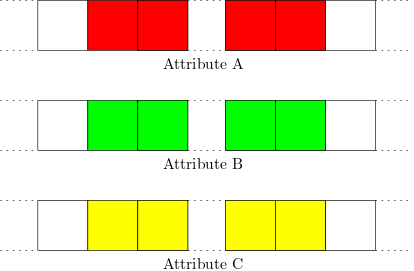

# Population objects

As explained briefly in the ReadMe, SamPy do not provide individual objects for the agents. Instead, SamPy provides population object which, as their names suggest, represent collections of agents. Typically, in an ecological simulation involving `N` number of species, there will be `N` population objects (one for each species).

## Dataframe df_population and memory layout of agents attributes

Each population object as an attribute called `df_population`, which is a DataFrameXS and is used to store all the attributes of the agents. This is done as follows.

Assume our agents have three attributes called `A`, `B` and `C`, then `df_population` has three columns named, you guessed it, `A`, `B` and `C`. Each row of the dataframe corresponds to exactly one agent in the population, and the attributes of the agents at row `i` are simply `df_population['A'][i]`, `df_population['B'][i]` and `df_population['C'][i]`.

Since our dataframes' columns are numpy arrays, those attributes are stored in memory in contiguous blocks (one for each attribute). With the above example, the memory layout could look something as shown in the following figure.

<p align="middle">
  
</p>

## Consequence of this memory layout on performance

As explained in the README, SamPy is designed to work best with a specific activation scheme. 

```python
for timestep in range(nb_timesteps):
    agents.perform_action_1(some_param_1)
    agents.perform_action_2(some_param_2)
    agents.perform_action_3(some_param_3)
```

## Focus on the position of each agent 

The localisation of each agent is especially important in a spatial ABM. 