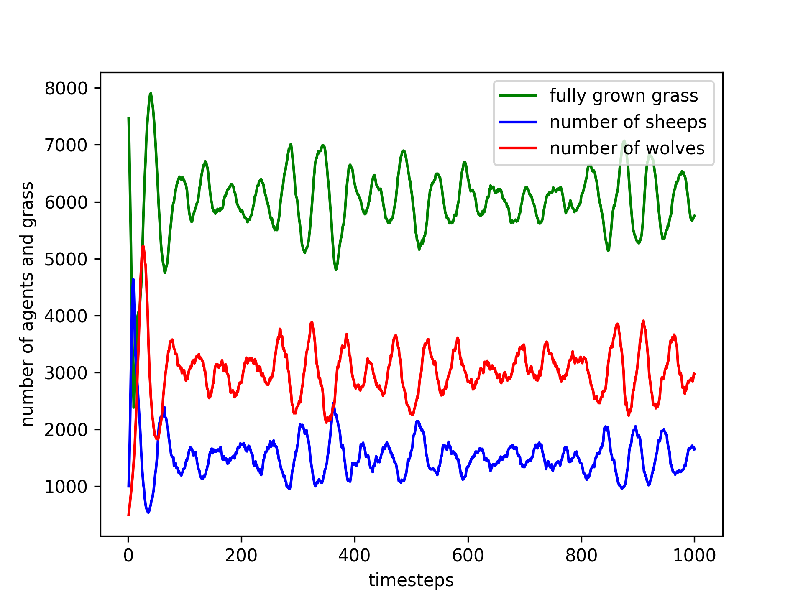
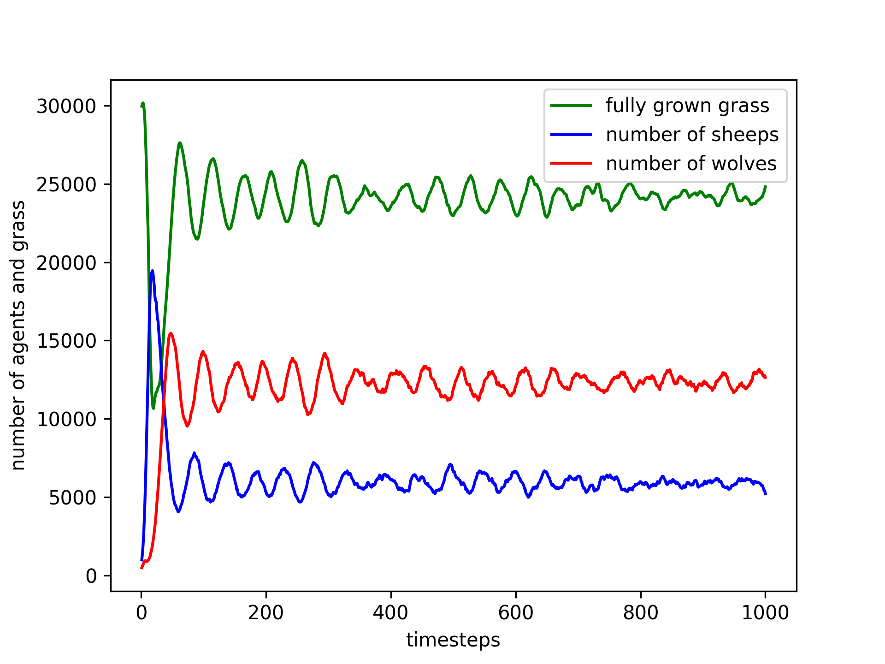
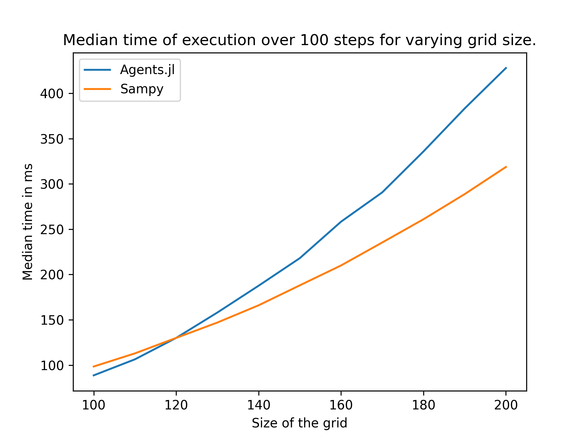
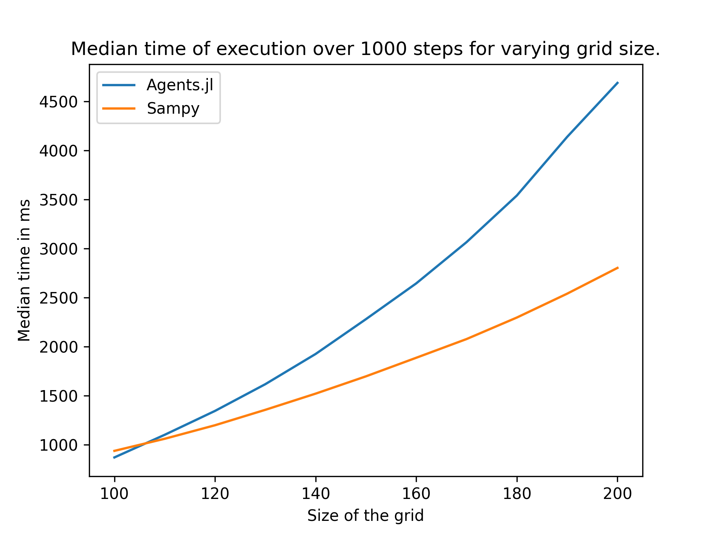

# The Wolf-Sheep model

In this example, we will detail the construction of a simple wolf-sheep model with SamPy. We also compare Sampy's performances against those of the [wolf-sheep model] of Agents.jl (the best performing ABM framework to date), and we discuss this comparison.

## Presentation of the wolf-sheep model

The [wolf-sheep model](http://ccl.northwestern.edu/netlogo/models/WolfSheepPredation(DockedHybrid)) is a famous example of predator-prey ABM, often used as an introductory example in ABM frameworks. This model features two class of agents, sheeps and wolves, living and moving on a square grid, as well as a grid based ressource called grass. The model can be formally described as follows.

1. Time is discrete.
2. The space is a square grid with Moore neighborhood. That is, a cell is connected to all its 8 neighbors.
3. Grass is represented with an integer counter on each cell. At each timestep, this counter is incremented by one until a user defined threshold is reached. Once  reached on a cell, the grass stops growing and is considered fully grown.
4. Each agent have an `energy` attribute, which is reduced at each timestep and can be replenished by eating (see below).
5. At each time step, the agents perform the following actions (starting with the sheeps and then moving to the wolves).
    1. They change position by moving to one of the neighboring cells (with equal probability between the 8).
    2. They eat what is available on their cell (either fully grown grass if the agent is a sheep, or a unique sheep if the agent is a wolf) and gain energy as a result. If nothing is available, nothing happens at this step.
    3. They loose one energy and die if it drops below zero.
    4. They attempt to reproduce as follows: each agent performs a Bernouli test (the parameter depends on wether the agent is a sheep or a wolf); if succesful it creates a copy of itself and its energy is split equaly between itself and the copy. The copy is created on the same square as the original. 

## Implementation in Sampy

We construct the model by following the usual SamPy process, that is by first chosing a graph (i.e. the space on which the agents live) and then constructing the population objects.

### Chosing the graph

Sampy provides two built-in Graph representing square grids, `SquareGrid` and `SquareGridWithDiag`. Since we want a Moore neighborhood, we chose the later. Moreover, we want each agents to have an equal probability to move to every neighbour, so we set the `equi_prob` kwarg to `True`. In the end, for a grid of 100x100, the chosen graph is constructed like so:

```python
graph = SquareGridWithDiag(shape=(100, 100), equi_prob=True)
```

Grass can be easilly added to the graph (or modified) as an attribute, using the method `create_attribute_from_2d_array` as follows.

```python
grass_map = np.random.randint(0, 10, graph.shape) # just an example
graph.create_attribute_from_2d_array('grass', grass_map)
```

### Construction of the population objects.

We construct the sheeps and wolves population objects by combining existing building blocks, and by creating a new one for energy management. 

First, we need a `Base` building block. For our purpose here, the lightest one, i.e. `BaseAgent` works well, as it takes care of linking the population with the graph object, creates the dataframe `df_population` which holds the informations of every agents, and provides a few useful functionalities (like various options to add new agents). 

We then need a building block to deal with agents movement. Since here movements are very simple (i.e. agents just move to a neighbouring cell without any condition), we chose the building block `BasicMovement`. It adds a new column named `position` to the dataframe `df_population`, which holds the id of the squares on which each agent lives. It also provides a new method, `change_position` which makes all the agents move to one of the neighbouring square (there are options to move only some selected agents, but we will not need it for the wolf sheep model). 

Finally, we need another building block, used by both sheeps and wolves, which creates an energy attribute, add a method to manage it as well as a method for reproduction. This block can be defined as follows.

```python
class EnergyReproductionWSModel:
    def __init__(self, **kwargs):
        # we create a new agent attribute, that stores the energy of each agent.
        # We set its default value to 0.
        self.add_attribute('energy', def_value=0.)

    def loose_energy(self):
        """
        Decrease the energy of all the agents by 1, and then kills the agents
        whose energy is below zero.
        """
        if self.number_agents == 0:
            return
        
        self.df_population['energy'] -= 1.

        # we delete the agents whose energy is below zero, simply by removing their
        # corresponding lines in df_population. 
        survive = self.df_population['energy'] >= 0
        self.df_population = self.df_population[survive]

    def reproduce(self, prob_reproduction):
        """
        Clone some agents as follows:
            1. each agent performs a Bernoulli test using 'prob_reproduction' as parameter
            2. those who succeed get their energy divided by half, and then are cloned.
        """
        if self.number_agents == 0:
            return
        
        arr_reproduction = np.random.uniform(0, 1, self.number_agents) < prob_reproduction
        
        # we divide by 2 the energy of the agents that reproduce
        self.df_population['energy'] -= arr_reproduction * self.df_population['energy'] / 2.

        # we copy the lines of df_population corresponding to reproducing agents, and we add 
        # new agents with the obtained DataFrame 
        new_agents = self.df_population[arr_reproduction]
        self.add_agents_from_dataframe(new_agents)
```

We can now construct the Sheeps and Wolves classes, in which we define their specific "eat" methods. We begin with the Sheeps.

```python
@sampy_class
class Sheeps(BaseAgent,
             EnergyReproductionWSModel,
             BasicMovement):
    
    def __init__(self, **kwargs):
        pass

    def eat(self, delta_energy, grass_threshold, shuffle=True):
        """
        Eat grass that reached a specific grass_threshold. Each sheep who succesfully ate
        a patch of grass gains delta_energy energy as a result.
        """
        if self.number_agents == 0:
            return
        
        if shuffle:
            self.shuffle()

        eat_grass(self.df_population['position'], self.graph.df_attributes['grass'],
                  self.df_population['energy'], delta_energy, grass_threshold)
```

Note the usual structure for a sampy class, with the decorator `sampy_class` on top and the `__init__` method accepting `**kwargs` even if, technically, it does nothing (it is required for the decorator to work). The only thing that remains is to write down the function `eat_grass`, which is compiled with numba in order to ensure the best performances. As shown below, its construction is straightforward.

```python
@nb.njit
def eat_grass(arr_position, arr_grass, arr_energy, delta_energy, grass_threshold):
    """
    Loops through the sheeps positions (arr_position). If there is fully grown grass (its
    level is above grass_threshold) on the position, the grass level there is set to 0, 
    and the sheep gains some energy (delta_energy).
    """
    for i, pos in enumerate(arr_position):
        if arr_grass[pos] >= grass_threshold:
            arr_grass[pos] = 0
            arr_energy[i] += delta_energy 
```

We now focus on the Wolves class.

```python
@sampy_class
class Wolves(BaseAgent,
             EnergyReproductionWSModel,
             BasicMovement):
    
    def __init__(self, **kwargs):
        pass

    def eat_on_position(self, sheeps, delta_energy, shuffle=True):
        if sheeps.number_agents == 0 or self.number_agents == 0:
            return

        if shuffle:
            sheeps.shuffle()
            self.shuffle()

        surviving_sheeps = eat_sheep_on_pos(self.df_population['position'], 
                                            sheeps.df_population['position'],
                                            self.df_population['energy'], delta_energy)
        sheeps.df_population = sheeps.df_population[surviving_sheeps]
```

As we can see, the construction of this class is mostly similar to the one of the Sheeps class. The only difference being that the function `eat_sheep_on_pos` returns an array of booleans telling which sheep survived. This function can be constructed as follows.

```python
@nb.njit
def eat_sheep_on_pos(wolves_pos, sheeps_pos, energy_wolf, delta_energy):
    """
    Deals with wolves eating. Returns an array of booleans telling which sheep survived.

    It first creates a dictionnary whose keys are positions on which there are sheeps, 
    and values are lists of integers (which are the position of the lines of each sheep
    within their population dataframe). 
    
    Then, it loops through the wolves and they eat one of the surviving sheep on their 
    position, if any.
    """
    # we begin with creating a dictionnary which stores the position of all the sheeps
    dict_sheeps_pos = dict()
    for i, sheep_pos in enumerate(sheeps_pos):
        if sheep_pos in dict_sheeps_pos:
            dict_sheeps_pos[sheep_pos].append(i)
        else:
            list_dict = List()
            list_dict.append(i)
            dict_sheeps_pos[sheep_pos] = list_dict

    # it's time to eat!
    surviving_sheep = np.full(sheeps_pos.shape, True, dtype=np.bool_)
    for i, wolf_pos in enumerate(wolves_pos):
        if wolf_pos in dict_sheeps_pos:
            for index_sheep in dict_sheeps_pos[wolf_pos]:
                if surviving_sheep[index_sheep]:
                    energy_wolf[i] += delta_energy
                    surviving_sheep[index_sheep] = False
                    break

    return surviving_sheep
```

### The model 

Now that we have all the pieces, we can write down the model itself. In this case, we collect the number of wolves, sheeps and fully grown grass at each timestep in order to draw some graphs. The parameters we chose are taken from the large Wolf-Sheep model of Agents.jl's benchmarks [Link].

```python
# parameters
nb_steps = 100
nb_wolves = 500
nb_sheeps = 1000
shape = (100, 100)
repro_sheeps = 0.4
repro_wolves = 0.2
grass_regrowth = 10
delta_energy_sheep = 5
delta_energy_wolf = 13

# setting up the objects
graph = SquareGridWithDiag(shape=shape, equi_prob=True)
sheeps = Sheeps(graph=graph)
wolves = Wolves(graph=graph)

# creating the grass and set it initial growth level
grass_map = np.random.randint(0, 2 * grass_regrowth + 1, graph.shape)
grass_map[grass_map >= grass_regrowth] = grass_regrowth
graph.create_attribute_from_2d_array('grass', grass_map)

# create the list that will store the number of agents and grass
list_grass = []
list_nb_wolves = []
list_nb_sheeps = []

# now the main loop of the model
for _ in range(nb_steps):

    # count everything
    list_grass.append( (graph.df_attributes['grass'] >= grass_regrowth).sum() )
    list_wolves.append(wolves.number_agents)
    list_sheeps.append(sheeps.number_agents)

    # sheeps part
    sheeps.change_position()
    sheeps.eat(delta_energy_sheep, grass_regrowth)
    sheeps.loose_energy()
    sheeps.reproduce(repro_sheeps)

    # wolves part
    wolves.change_position()
    wolves.eat_on_position(sheeps, delta_energy_wolf)
    wolves.loose_energy()
    wolves.reproduce(repro_wolves)

    # grass regrowth
    graph.df_attributes['grass'] += graph.df_attributes['grass'] < grass_regrowth
```

## A few illustrations

With the previous code, we can generate a graph showing how populations and grass evolve during a simulation.

<p align="middle">
  
</p>

As can be seen here, the cumulated number of agents (wolves + sheeps) hover around 4500, which is quite low compared to the kind of population Sampy is optimized for (typical rabies applications have populations of several hundred thousands). Let see if we can get those numbers higher with a larger grid size (200x200) 

<p align="middle">
  
</p>

In this case, as we could expect, the total population is approximatively 4 times higher than in the previous case.

## Performances and comparison with Agents.jl

In this section we evaluate the performances of our Wolf-Sheep model and we compare them to Agents.jl performances. Note however that there are a few points worth discussing about this comparison, and we refer the reader to the next section for this discussion. To do so, we follow the following methodology.

1. We define a function that takes a graph of shape (NxN) and a number of timesteps `nb_timesteps` as arguments. This functions returns the time it took to run the wolf-sheep model (with the parameters used above) for `nb_timesteps`.
2. We run the function 101 times and we discard the first recorder time of execution (which includes the compilation time from Numba).
3. We take the median value of those 100 execution times and use it as a measure of the performance of our model on a grid of size NxN.
4. We repeat the above for square grid sizes ranging from 100x100 to 200x200 by increment of 10, and we dot it for both 100 and 1000 timesteps.
5. We do the same with Agents.jl using the benchmark code provided [there], and we plot the performances of both models on a graph.

You can find the code used to get Sampy's times [here]. On the following graph, we show the performances of Sampy and Agents.jl.

<p align="middle">
  
   
</p>

As we see, as the grid size grows larger, Sampy outperforms Agents.jl.

## Discussion regarding the previous comparison

As mentionned in the begining of the previous section, there are a few things to discuss about our comparison between Sampy and Agents.jl. 

1. Sampy was designed with ecological and epidemiological applications in mind. In this setting, there are a lot of uncertainties about the parameters, which means any project likely requires thousands of repetitions. As a consequence, graphs are designed to be re-used accross those repetitions and there is no need to recreate a new one for each model run. We exploited this fact in our benchmark by having the graph as a parameter of our function and by re-initializing the grass growth status at the beginning. However, to my knowledge, it is not something that can be easily reproduced in Agents.jl, so a part of the difference in performance may come from this (depending on how the grid is encoded/constructed within Agents.jl). If you want to include the graph creation in the benchmark, keep in mind that, given the above, the code creating the graph has not been particularly optimized (i.e. it is written in pure python and is not compiled with Numba) so a good part of the execution time would actually consist of python painfuly looping through two big Numpy arrays. 
2. Sampy makes an extensive use of Numba for its computations. In short, Numba allows to compile some functions written in Python, but this compilation is done at run-time (at the time of writting this document, there are discussions to add ahead-of-time compilation to Numba but no final solution has been accepted yet). This causes the first execution of any "Numba-compiled" function to take far longer than the next executions, since it includes compilation time. In our benchmark, this causes the first of each batch of model run to take far longer than the rest (typically one second longer). We chose to discard this first run, but given that our metric is the median execution time of each batch, the end result would be similar if we had kept it. Measuring the median execution time with compilation time included would be quite tedious given that Numba does not come with an obvious way to force re-compilation.
3. Even if it may not be obvious at first glance, given that Agents.jl first loops through the sheeps and then through the wolves, both activation scheme (from Sampy and from Agents.jl) are equivalent in the case of this model. It may not be true anymore if one chose a different activation scheme for Agents.jl model.  