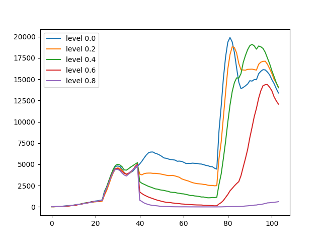

# How to add interventions in a model

One of the main motivation for Sampy's development was to have a tool able to run efficiently a large number of simulations in order to assess the efficiency of planned intervention strategies in the context of rabies in North America. As such, Sampy includes a series a built-in intervention object used to represent real life interventions on an epidemics (like vaccination).

**_NOTE:_** the assessment of intervention strategies is a context in which a lot of simulations are required. Therefore, it calls for models running in parallel on multiple processes. Sampy provides a few tools to ease the management of such models, but since multiprocessing in python requires at least some knowledge of python (and is OS dependant), those will be detailed in an advanced guide.

## Choice of the intervention

Currently Sampy provide two built-in interventions, `BasicCulling` and `BasicVaccination`, the first modelling culling intervention (the targeted removal of agents) and the later modelling vaccination (the targeted immunization of agents). Here we will focus on `BasicVaccination` (the culling object behaves roughly the same as the vaccination one).

## How to use the vaccination object

A `BasicVaccination` object works as follows.

1. It targets one specific disease, which is given by the user at construction.
2. Vaccines stay effective for a user defined duration. While under the effect of an effective vaccine, an agent is totally immuned to the disease.
3. Several methods are available to vaccinate the population, and they all work on the same principle: the user provides locations (i.e. vertices) with associated probability values representing the chance for an agent on those locations to be vaccinated. 

To be instanciated, the vaccination object requires a disease object as well as an integer. This second parameters represents the number of timesteps a vaccinated agent remains immunized to the disease. The object creation is done as follows.

```python
from sampy.intervention.built_in_interventions import BasicVaccination

# [population and disease creations here]

vaccination = BasicVaccination(disease=disease, duration_vaccine=156)
```

Once created, this object should be used in the main loop of the model as follows.

1. At the beginning of each iteration of the main loop, the method `update_vaccine_status` (does not take any parameters) should be called. Essentially, it performs a series of internal updates required for the vaccine to work properly.
2. There are two main methods to apply vaccine to the population, `apply_vaccine_from_array` and `apply_vaccine_from_dict`. The former is more optimized but requires some understanding of Sampy's internal components, so we will focus on the latter. It expects two argument, the graph object and a dictionnary `dic`, whose keys are id of vertices and values are floats between 0 and 1. Basically, if a `vertex_id` is a key in this dictionnary, then each agent on `vertex_id` at the time of application has a probability of `dic[vertex_id]` to be vaccinated. Note that, by default, only susceptible agents can recieve vaccine (not infected, nor contagious nor immuned).

In the code, it looks like this.

```python
# start of the main loop itself
nb_year_simu = 3
for week in range(nb_year_simu * 52):

    vaccination.update_vaccine_status()
    if week == 30: # we apply vaccine at week 30 of the first year here.
        vaccination.apply_vaccine_from_dict(my_graph, dic)

    # [rest of the loop]
```

## Example

Here, we illustrate the effect of a simple vaccination strategy for varying proportion of immunized agent. Vaccine is spread on a disk centered on the square (50, 50) with a fixed radius of 30 kilometers (assuming each square of the grid has 1km sides). A simulation runs as follows.

1. We load a pre-built population and we contaminate agents on the four central grid cell (as in the previous section).
2. We record the number of infected agents at each timestep.
3. 40 timesteps after the disease has been unleashed, we vaccinate a portion of the population with the method described above.
4. We continue the simulation until 104 timesteps (2 years) have passed since the beginning.
5. We repeat this process 5 times with various level of vaccination to see how its effects vary (0., 0.2, 0.4, 0.6, 0.8).

We begin with a function returning the dictionary to be fed to the method `apply_vaccine_from_dict`.

```python
def create_disk_vaccine(grid_shape, center, radius, level_vaccine):
    """
    Returns a dictionnary to be fed to apply_vaccine_from_dict. Note that this function is not particularly optimized and is not designed for intensive use.

    :param grid_shape: couple of integers, shape of the square grid.
    :param center: couple of integers, coordinates of the square on which the disk should be centered.
    :param radius: float, radius of the disk.
    :param level_vaccine: float between 0 and 1.
    """
    r_dict = dict()
    for i in range(grid_shape[0]):
        for j in range(grid_shape[1]):
            if (i - center[0]) ** 2 + (j - center[1]) ** 2 <= radius ** 2:
                r_dict[(i, j)] = level_vaccine
    return r_dict
```

The main loop of our model is as follows.

```python
nb_year_simu = 2
count_inf = []
for week in range(nb_year_simu * 52):

    count_inf.append((agents.df_population['inf_disease'] | agents.df_population['con_disease']).sum())
    if week%52 == 0:
        print(count_inf[-1])

    agents.increase_age()
    agents.kill_too_old(52 * 6 - 1)
    agents.natural_death_orm_methodology(arr_weekly_mortality, arr_weekly_mortality)
    agents.kill_children_whose_mother_is_dead(11)
    vaccination.update_vaccine_status()

    # apply vaccine
    if week == 39:
        vaccination.apply_vaccine_from_dict(my_graph, create_disk_vaccine((100, 100), (50, 50),
                                                                        30, vac_level))

    # disease part
    disease.tick() # required to update disease status. if forgotten, nothing disease related
                # will happen.
    agents.mov_around_territory(0.5, condition=agents.df_population['age'] >= 11)
    disease.simplified_contact_contagion(0.1, np.array([1, 2, 3, 4]), 
                                                    np.array([0.25, 0.25, 0.25, 0.25]),
                                                    return_arr_newly_contaminated=True)
    disease.simplified_transition_between_states(0.8, np.array([1, 2]), np.array([0.5, 0.5]))

    if week % 52 == 15:
        agents.find_random_mate_on_position(1., position_attribute='territory')
    if week % 52 == 22:
        agents.create_offsprings_custom_prob(np.array([4, 5, 6, 7, 8, 9]), 
                                            np.array([0.1, 0.2, 0.2, 0.2, 0.2, 0.1]))
    if week % 52 == 40:
        can_move = agents.df_population['age'] > 11
        agents.dispersion_with_varying_nb_of_steps(np.array([1, 2, 3, 4]),
                                                np.array([.25, .25, .25, .25]),
                                                condition=can_move)
```

finally, we obtain the following curves.

<p align="middle">
  
</p>
