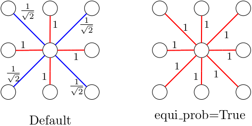
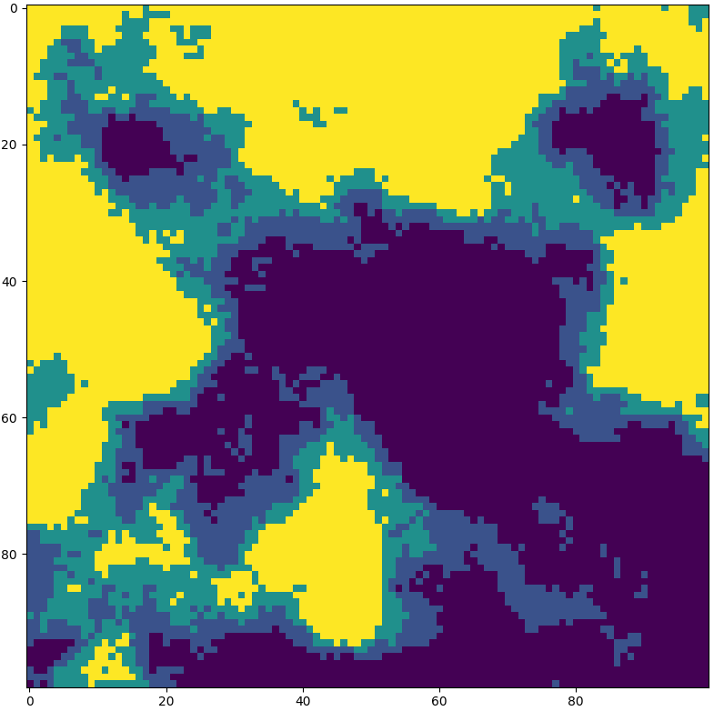

# How to chose and construct a square grid

The first step in the construction of any model using Sampy is to chose the space on which the agents live. In the current version of Sampy, space is encoded using a graph-based approach that we now describe (note that there are other type of spaces planned for the future).

## Graphs in Sampy

Conceptually, a graph is a set of vertices linked together by edges. Graphically, a graph looks like this:

[include figure]

In sampy, agents live on the vertices of a graph and move according to its edges. As such, you can think of vertices as representing patches of land and you can visualize an edge between two vertices as meaning that the corresponding patches of land are neighbours. Finally, note that edges in Sampy are weighted, and a given weight represents the probability for an agent to move along the associated edge. 

## The two main square grids

Sampy provides several built-in graph adapted to a variety of situations. In the current tutorial, we want the space to be a square grid and Sampy provides two options for representing one using graphs, respectively called `SquareGrid` and `SquareGridWithDiag`. They differ by their set of edges, as shown below.

<p align="middle">
  
</p>

Technically, `SquareGrid` encodes a square grid with [Von Neumann neighborhood] and `SquareGridWithDiag` encodes a square grid with [Moore neighborhood]. Both can be easilly instantiated by providing a shape to its constructor, as shown below with 100x100 grids.

```python
from sampy.graph.builtin_graph import SquareGrid, SquareGridWithDiag

von_neuman_grid = SquareGrid(shape=(100, 100))
moore_grid = SquareGridWithDiag(shape=(100, 100))
```

Finally, note that `SquareGridWithDiag` have, by default, smaller weights on the diagonal edges than on the horizontal/vertical ones. This can be changed to ensure equal probability of movement between all 8 direction by constructing the grid as follows `SquareGridWithDiag(shape=(100, 100), equi_prob=True)`. 

<p align="middle">
  
</p>

## Which one to chose?

Ultimately, chosing one graph over the others depends on your model specifications. However, as a general rule of thumb, note that `SquareGridWithDiag` with default settings is the one that gives the most realistic results on ecological models, and is generally the prefered choice. However, despite its potential shortcomings (such as artefacts on some models), `SquareGrid` leads to better performances and may be a valid choice in very computationally heavy models. A middle ground between performance and realisticity can be found in the graph `OrientedHexagonalLattice`, but its usage is a bit less intuitive than a square grid and will be discussed in another guide (WIP).

In this guide, we will use `SquareGridWithDiag` with a shape of 100x100 and default settings for our models.

## How to create and modify vertex attributes

In this section we show how to add and modify attributes on the vertices of square grids. We will use the example of carrying capacity, which is by convention denoted by the letter `K`. By definition, the carrying capacity of an habitat is the number of animals of a given species that it can sustain. There is obviously quite a lot of possible way to define this number (for instance it can represent the average number of animals during a given period, but there are other definitions), and it can even vary accross time (for instance in winter, or as a consequence of an ecological change). However we will not go into those consideration here.

Let start with the simplest case first by setting a carrying capacity `K` of 10 on every square of our grid.

```python
# we use the moore grid from above and we create a new vertex attribute
# named K with a value of 10 everywhere.
moore_grid.create_vertex_attribute('K', 10.)
```

As simple as that. Let's now move on to a more realistic case. Assume that we have a 2D array `K_distribution` of the same shape as our graph that contains varying values for `K`, like the own shown below (it has been generated with the middle-point displacement algorithm from the library [NLMpy]).

<p align="middle">
  
</p>

We can apply this distribution directly to our graph as follows.

```python
# K_distribution is assumed to be a 2D numpy array of same shape as
# the graph
moore_grid.create_or_update_attribute_from_2d_array('K', K_distribution)
```

You can use the same method to update the value of an attribute if needed.

## Some limitations on the attributes

In the current version of Sampy, not every data type is allowed to become a vertex attribute. That is, an attribute should either be made of floats, integers or booleans, and those data type cannot be mixed up within a single attribute.  
